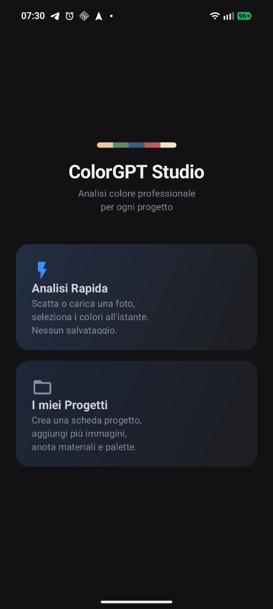
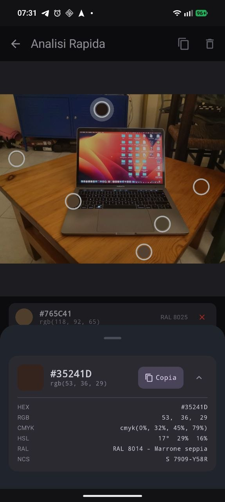
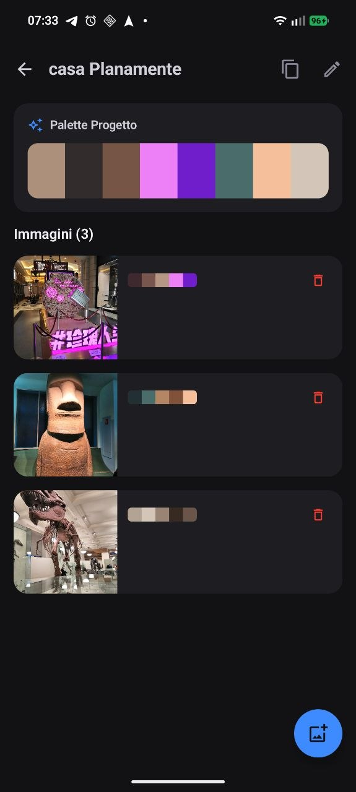

# ColorGPT Studio

> *Less, but better.* — Dieter Rams

A professional color analysis tool for craftsmen, painters and woodworkers.  
Built with the belief that a tool should get out of your way and let you work.

---

## What it does

ColorGPT Studio turns a photo into a complete color report — on-site, offline, in seconds.

Pick a point on any image and the app extracts the exact color, then translates it into every format a professional might need: the hex code for a screen, the RAL number for the paint supplier, the CMYK values for print, the NCS code for an architect's spec sheet.

Every color is annotated, tagged and organized inside projects, so the data you collect on a job site is always waiting for you when you sit down to write the quote.

---

## Screens

| Home | Quick Analysis | Project |
|------|---------------|---------|
|  |  |  |

---

## Core features

- **Tap-to-pick** — touch any pixel on an imported or camera photo to extract its color  
- **Full color vocabulary** — HEX · RGB · CMYK · HSL · RAL Classic (80 + entries) · NCS approximation  
- **Copy to clipboard** — single color or full palette, formatted for paste into any document  
- **Projects** — group images under a named job; the global palette is computed automatically from all picks  
- **Annotate** — label, note, material/product code and craft tags per color point  
- **Tag system** — 80 + preset tags across 7 professional categories, loaded from `tags_preset.json`; custom tags are persisted and offered as autocomplete suggestions  
- **Quick Analysis** — ephemeral session for fast on-site checks, no project required  
- **Real-time sync** — any change to an image or color point is reflected immediately across all screens  

---

## Design philosophy

The UI takes its cues from the **Braun / Dieter Rams** school of thought:

- **Form follows function** — every element earns its place by doing something useful  
- **Restraint** — a near-neutral palette (off-whites, warm grays, deep blacks) with a single functional accent (`#3D8BFF`) reserved for primary actions — the same logic Rams used for Braun's green power buttons  
- **Geometry over decoration** — cards with consistent corner radii, no gradients, no drop shadows for style — only for depth  
- **Readable hierarchy** — large, confident labels for values the craftsman actually reads; muted secondary text for everything else  
- **Silence when idle** — screens do not shout for attention; the image and the colors speak

---

## Tech stack

| Layer | Library / Tool | Version |
|-------|---------------|---------|
| Language | **Kotlin** | 1.9.24 |
| UI toolkit | **Jetpack Compose** + Material 3 | BOM 2024.06 |
| Navigation | **Navigation Compose** | 2.7 |
| Database | **Room** + KSP | 2.6.1 |
| DI | **Koin** | 3.5.6 |
| Image loading | **Coil** | 2.6 |
| Color extraction | Custom **K-means clustering** (pure Kotlin, no native deps) | — |
| Palette merge | Custom greedy RGB-distance clustering (`MergeProjectPaletteUseCase`) | — |
| RAL table | 80 + colors embedded in `ColorData.kt` companion object | — |
| Tag data | `tags_preset.json` in `assets/`, custom tags in `SharedPreferences` | — |
| Build system | **Gradle** + AGP | 8.9 / 8.5.1 |
| Min SDK | Android 8.0 (API 26) | — |
| Target / Compile SDK | Android 15 (API 35) | — |

---

## Project structure

```
app/src/main/java/com/example/colorgptstudio/
├── data/
│   ├── db/                  # Room entities, DAOs, AppDatabase
│   ├── repository/          # ProjectRepositoryImpl (flatMapLatest + combine reactive chain)
│   └── tags/                # TagRepository — preset JSON + custom SharedPreferences
├── di/                      # Koin modules (database, repository, viewmodel)
├── domain/
│   ├── model/               # ColorData · ColorPoint · ColorPalette · Project · ProjectImage
│   ├── repository/          # ProjectRepository interface
│   └── usecase/             # ExtractPaletteUseCase · MergeProjectPaletteUseCase
├── ui/
│   ├── analysis/            # AnalysisScreen + AnalysisViewModel
│   ├── components/          # ColorDetailSheet · TagInputField · PaletteCard · ColorSwatchRow
│   ├── home/                # HomeScreen
│   ├── project/             # ProjectListScreen · ProjectDetailScreen + ViewModels
│   ├── quickanalysis/       # QuickAnalysisScreen + QuickAnalysisViewModel
│   └── theme/               # ColorGPTStudioTheme (Material 3)
└── util/
    └── ColorExtractUtils.kt # Shared pixel-extraction helper
app/src/main/assets/
└── tags_preset.json         # 7 categories · ~80 professional preset tags
```

---

## Getting started

```bash
# Clone
git clone https://github.com/plana93/ColorGPTStudio.git
cd ColorGPTStudio

# Build & install (device or emulator must be connected)
./gradlew installDebug
```

No API keys, no cloud services, no internet permission required.  
Everything runs locally on the device.

---

## License

MIT
